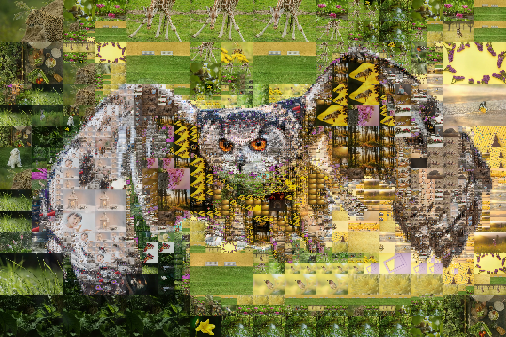

# VideoMosaic

Generate your video/photo mosaic.




## Installation

### Prebuilt binaries

Watch the [releases](https://github.com/YXL76/VideoMosaic/releases) page.

### Build from source

#### Requirements

- [Rust](https://www.rust-lang.org/) nightly
- [FFmpeg](https://www.ffmpeg.org/)

#### Build

```shell
git clone https://github.com/YXL76/VideoMosaic.git
cd VideoMosaic
cargo build --release
```

## Interface

- [GUI](gui)
- [CLI](cli)

## Usage

```shell

```

## Reference

- [Photographic mosaic](https://en.wikipedia.org/wiki/Photographic_mosaic)
- [Mazaika](https://www.mazaika.com/index.html)

## Acknowledgements

- [grokify/gosaic](https://github.com/grokify/gosaic)
- [okaneco/kmeans-colors](https://github.com/okaneco/kmeans-colors)
